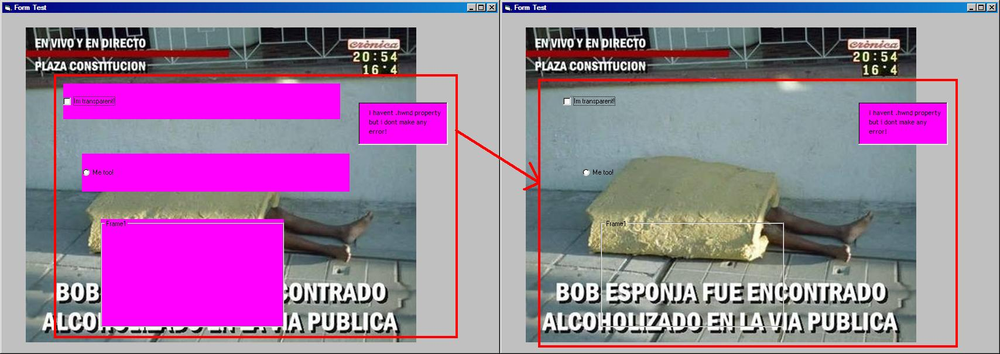



## Check Box, Option Box and Frames transparent

### Description

It's a class that converts opaque CheckBoxs, OptionBoxs and Frames to TRANSPARENT!. Easy to use, very effective. It can be used with other controls with properties .hwnd and .backcolor . There is only one error: blurred fonts doesn't work fine with the transparency function. Sorry for my bad english!. Comments are welcome!

Thanks to GioRock for the tip.

I forget to say: the clickeable area will be the non transparent region.
 
### More Info
 
Simple, the object.

nothing...

True if succeeds or False if not

             |
---                |---
**Submitted On**   |2009-01-22 19:06:40
**By**             |[el\_c0c0](https://github.com/Planet-Source-Code/PSCIndex/blob/master/ByAuthor/el-c0c0.md)
**Level**          |Advanced
**User Rating**    |4.8 (19 globes from 4 users)
**Compatibility**  |VB 5\.0, VB 6\.0
**Category**       |[Custom Controls/ Forms/  Menus](https://github.com/Planet-Source-Code/PSCIndex/blob/master/ByCategory/custom-controls-forms-menus__1-4.md)
**World**          |[Visual Basic](https://github.com/Planet-Source-Code/PSCIndex/blob/master/ByWorld/visual-basic.md)
**Archive File**   |[Check\_Box\_2141481252009\.zip](https://github.com/Planet-Source-Code/el-c0c0-check-box-option-box-and-frames-transparent__1-71652/archive/master.zip)

